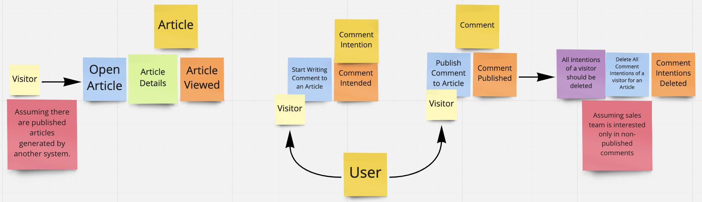

## Setup

**NOTE**: If you are running Mac with M1 chip, MySQL container could have some issues, so you will need to download and run it natively on your local machine.

### Requirements:

- [Composer](https://getcomposer.org/doc/00-intro.md)
- [Docker](https://docs.docker.com/get-docker/) & [Docker Compose](https://docs.docker.com/compose/install/)
- (*Mac with M1 chip*) [MySQL](https://dev.mysql.com/downloads/mysql/)
- (*Mac with M1 chip*) Once you have MySQL setup up and running, make sure you have setup testing DB as well.

### Installation:

- Clone repository
- Run `composer install`
- Clone .env.example file and rename it to .env
- Run `php artisan key:generate`
- Make sure you have setup all the necessary DB env variables in .env file (+ create a DB for the tests)
- Run `docker-compose -up` (For M1 run `docker-compose up nginx php`)
- Run `docker exec php php artisan migrate` to run migrations
- Run `docker exec php php artisan db:seed` to run seeders

Project should be available at http://localhost:8088/

## Thought process

Here is quick overview of my ideas and assumptions while developing this project

Since assignment was mainly evolving around the visitors of a website and tracking their comment intentions, I have not introduced any functionality around publishing and deleting article.
Hence, my main focus was around the following domain events:
- Article Viewed/Opened
- Comment Intended by Visitor
- Comment published
- Comment Intention removed (as sales person will only be interested in non-published comments)

Also please see below the outcome of my small event storming session, where I have mapped out the process that I think the solution should solve. 

The dark yellow stickies represent the aggregates

The light yellow is the actor

The blue stickies are the commands/actions

The purple stickies are the business rules.

The orange stickies are the domain events.

### Assumptions

I have based and created my solution based on the following assumptions

- Publishing and tracking actions evolving around the Article are managed by another service
- Visitor is not interested in viewing other comments related to the Article, hence does not need to reply to other comments
- Sales team is not interested in the content of comment intention, but only in the user and the article to which had the intention
- Sales team is only interested in non-published comments, meaning that once comment is published user's intentions to comment should be deleted
- Having user access roles (e.g. author, visitor, sales person) is out of scope
- Authentication is out of scope
- Front end is going to be handled separately, there is the sole need of a RESTFul API backend system

### Architecture

My main idea when developing the project was to have a clean and solid architecture with as little dependencies as possible to the Laravel framework.
Hence, if, for instance, next year it is decided to move the project to Symfony framework, that migration should be possible with very little adjustments to the code base.

## Testing the project

### Useful Commands

- `composer analyse` - to run static code analysis tool (phpStan + Deptrac)
- `composer check-ddd` - to check project dependencies with Deptrac (configuration can be found in `depfile.yaml`)
- `composer check-cs` - to check code styling (just checking for issues)
- `composer fix` - to resolve any code styling issues (will write to files)
- `docker exec php php artisan test` - to run all test in the folder

### API endpoints
In docs folder you can also find an exported Postman collection, which you can use to run/test the API calls.

List of available endpoints in this project:

- `GET api/article/{id}`

- `POST api/comment/intended`

    Request Body: `{
  "user_id": 1,
  "article_id": 1
  }`

- `POST api/comment/publish`

    Request Body: `{
"user_id": 1,
"article_id": 1,
"message": "What a great article!"
}`

## If I had more time, I would have

- added a report so that sales team can download
- introduced integration tests to test the DB/Eloquent
- added tests on the command bus, to make sure messages are dispatched and handled
- Reduce the amount of dependencies on Laravel in the tests
- introduced behat to do the Feature/System tests. (seems like laravel 9 introduced psr/container dependency which is not yet supported by Behat )
